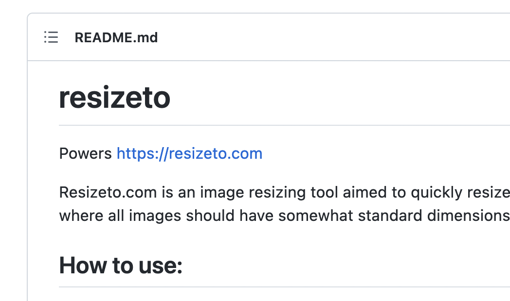
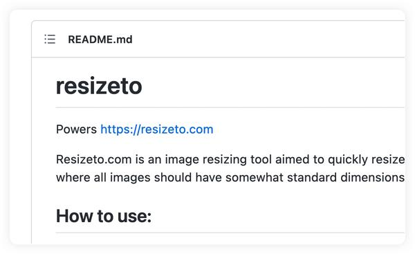
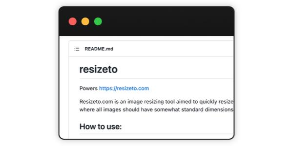
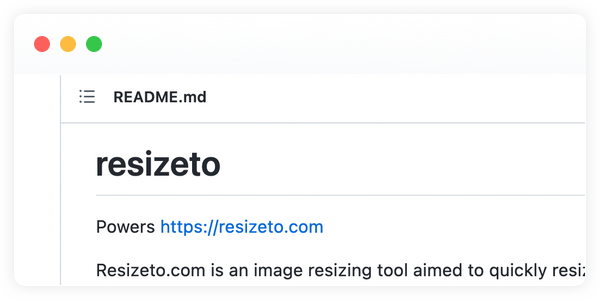

# resizeto

Powers https://resizeto.com

Resizeto.com is an image resizing tool aimed to quickly resize images for documentation and user guides where all images should have somewhat standard dimensions and file formats.

## How to use:

Create a link describing the desired image parameters such as width, height, padding, etc, and share that link with documentation authors. For example, <a href="https://resizeto.com/w_1000/h_500/f_fit/bg_ffffffff/as_jpg/q_75">https://resizeto.com/w_1000/h_500/f_fit/bg_ffffffff/as_jpg/q_75</a>

<strong>w</strong> &mdash; All generated images will have this width.

<strong>h</strong> &mdash; Height guideline, the exact result dimensions will depend on the fitting mode.

<strong>f</strong> &mdash; Fitting mode. <strong>fit</strong> to create <i>w &times; h</i> image and fit the source image completely inside. <strong>cover</strong> to create <i>w &times; h</i> image and size the source image to cover the area; some cropping may occur. <strong>extend</strong> to create an image with <i>w</i> width and the dynamic height of at least <i>h</i> to match the source image aspect ratio.

<strong>px</strong> &mdash; Horizontal padding.

<strong>py</strong> &mdash; Vertical padding.

<strong>as</strong> &mdash; <i>png</i> or <i>jpg</i>.

<strong>q</strong> &mdash; JPEG image quality.

<strong>bg</strong> &mdash; Resulting image background in RRGGBBAA hex format, i.e. FFFFFFFF is fully opaque white, FF00007F is semi-transparent red, etc.

All processing happens inside your browser window and no images are uploaded to servers. No tracking of any kind. Source code, bug reports, and requests at <a href="https://github.com/sergeystoma/resizeto">https://github.com/sergeystoma/resizeto</a>

## Examples:

Source image for all examples:

#### Create an image 600px wide, dynamic height based on the aspect ratio, save as JPG with 75 quality, and add a shadow frame.

https://resizeto.com/w_600/h_1/f_extend/bg_ffffffff/as_jpg/q_75/frame_shadow

Result:

#### Create an image 600px wide, 300px height, fit the source image to specified dimensions, save as JPG with 75 quality, and add a dark browser frame.

https://resizeto.com/w_600/h_300/f_fit/bg_ffffffff/as_jpg/q_75/frame_browserdark

Result:

#### Create an image 600px wide, 300px height, cover the entire available area, save as PNG, and add a light browser frame.

https://resizeto.com/w_600/h_300/f_cover/bg_ffffffff/as_png/frame_browserlight

Result:

## Acknowledgements

Resizeto uses Pica (https://github.com/nodeca/pica) for high-quality image resizing on the client side.

